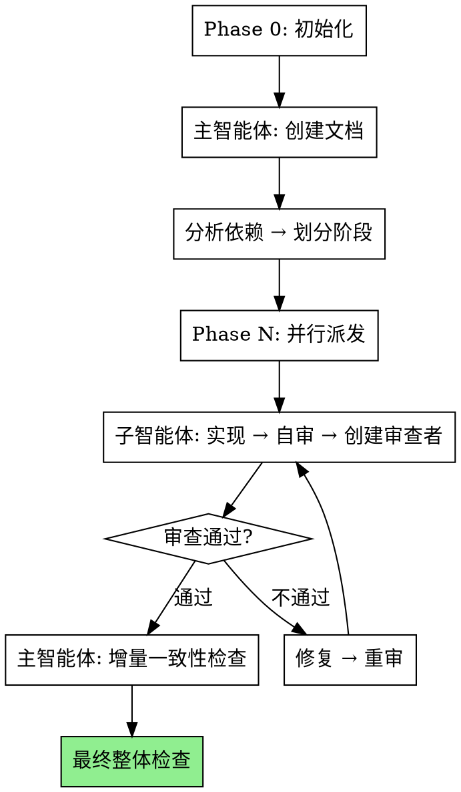

<div align="center">

# 🚀 Agent Fleet Command

### 多智能体编排框架 — 质量保障最出色的 Multi-Agent 解决方案


**三层架构 · 文档驱动 · 质量门禁 · 分阶段并行执行**

[安装指南](#-安装) · [快速开始](#-快速开始) · [工作原理](#-工作原理) · [框架对比](#-框架对比) · [场景推荐](#-场景推荐)

</div>

---

## 📖 项目简介

**Agent Fleet Command** 是一个基于 Skill 的多智能体编排框架，专为代码开发场景设计。核心理念是 **"主智能体永不写代码"**，通过三层架构实现职责分离，通过文档驱动确保设计先行，通过内置审查体系保障代码质量。

```
┌─────────────────────────────────────────────────────────┐
│  🏆 综合评分: ⭐⭐⭐⭐  7.88/10  (排名: 第2名/共4框架)  │
├─────────────────────────────────────────────────────────┤
│  ✅ 质量保障  10/10  │                                   │
│  ✅ 架构设计   9.5/10 │  ⭐ 三层职责清晰                 │
│  ✅ 创新性     9.5/10 │  ⭐ 多项独特设计                 │
│  ✅ 文档完善   9.5/10 │  ⭐ 模板完整清晰                 │
└─────────────────────────────────────────────────────────┘
```

---

## 🎯 核心特性

### 🏗️ 三层架构 — 职责边界最清晰

```
主智能体 (Orchestrator)
│   职责: 创建文档 + 派发任务 + 一致性检查
│   约束: 永远不读写代码文件
│
├── 子智能体 (Implementer)
│   │   职责: 阅读文档 + 检查Skill库 + 实现代码 + 自审
│   │   约束: 只能修改自己任务范围内的文件
│   │
│   └── 子子智能体 (Reviewer)
│           职责: 阅读两份文档 + 严格代码审查
│           约束: 只读不改，只报告问题
```

### 📄 文档驱动 — 强制先设计后实现

| 文档 | 内容 | 用途 |
|------|------|------|
| `project-overview.md` | 架构大纲、模块划分、依赖图、统一规范 | 全局指导 |
| `task-{name}.md` | 详细需求、验收标准、约束条件、技术提示 | 任务执行 |

### 🔍 审查体系 — 5维度 × 3级别

**审查维度:**
- ✅ 规格符合 — 代码实现了文档中所有功能点
- ✅ 约束遵守 — 只修改了允许的文件
- ✅ 全局一致 — 代码风格符合项目规范
- ✅ 代码质量 — 可读、可维护、错误处理完善
- ✅ 测试覆盖 — 测试覆盖主要功能

**严重程度:**
| 级别 | 处理 | 阻塞规则 |
|------|------|----------|
| 🔴 Critical | 必须修复 | 立即阻塞 |
| 🟡 Important | 应该修复 | 3个累积阻塞 |
| 🟢 Minor | 建议修复 | 不阻塞 |

### 🔄 执行流程 — 分阶段并行 + 审查循环



---

## 📦 安装

### 方式一：npx skills（推荐）

```bash
npx skills add https://github.com/huihuida10-droid/agent-fleet-command-skill
```

### 方式二：Claude Code 插件市场

```bash
/plugin marketplace add huihuida10-droid/agent-fleet-command-skill
```

### 方式三：手动复制

将 `skills/` 文件夹复制到对应 Agent 的 skill 目录：

| Agent | Skill 目录 |
|-------|-----------|
| Claude Code | `~/.claude/skills/` |
| Cursor | `~/.cursor/skills/` |
| OpenCode | `~/.config/opencode/skills/` |
| OpenAI Codex | `~/.codex/skills/` |

---

## 🚀 快速开始

### 0. 指定文档输出路径

启用 Skill 后，主智能体会首先询问：

```
请指定文档输出文件夹路径 (例如: ./project-docs/)
```

所有生成的 .md 文件将按以下结构组织：

```
{输出文件夹}/
└── {项目名称}/
    ├── 00-项目概览/
    │   ├── project-overview.md        # 架构总文档
    │   └── execution-plan.md          # 执行计划
    ├── 01-task-auth/
    │   ├── task-auth.md               # 任务需求文档
    │   └── review-result.md           # 审查结果
    ├── 02-task-users/
    │   ├── task-users.md
    │   └── review-result.md
    ├── 03-审查记录/
    │   └── consistency-check-*.md     # 一致性检查记录
    └── 04-执行日志/
        └── execution-log.md           # 完整执行过程
```

**打开文件夹即可了解项目全貌，按编号顺序阅读 = 按执行顺序回顾。**

### 1. 主智能体初始化

主智能体创建文档（自动写入对应文件夹）：

**project-overview.md**
```markdown
# 我的项目

## 项目目标
构建一个用户管理系统

## 模块划分
### 模块A: 用户认证
- 职责: 登录、注册、鉴权
- 依赖: 无
- 对应子任务: task-auth.md

### 模块B: 用户管理
- 职责: CRUD操作
- 依赖: 模块A
- 对应子任务: task-users.md

## 统一规范
- 代码风格: 2空格缩进
- 命名约定: camelCase
- 错误处理: 返回 { error: string }
```

**task-auth.md**
```markdown
# Task: 用户认证

## 任务目标
实现登录、注册、JWT鉴权

## 详细需求
### 功能点1: POST /api/auth/login
- 验收标准: 接受 {email, password}，返回 {token}
- 涉及文件: routes/auth.js, services/auth.js

### 功能点2: JWT中间件
- 验收标准: 验证token，注入userId
- 涉及文件: middleware/auth.js

## 约束条件
- 只能修改: routes/, services/, middleware/
- 不能修改: 用户管理模块文件
```

### 2. 分阶段执行

```
阶段1 (无依赖): 并行派发 task-auth
    ↓ 主智能体增量检查
阶段2 (依赖阶段1): 并行派发 task-users
    ↓ 主智能体最终检查
项目完成 ✅
```

### 3. 子智能体执行流程

```
接收任务
  → 阅读 project-overview.md (理解全局)
  → 阅读 task-auth.md (理解细节)
  → 检查Skill库，启用相关Skill
  → 实现代码 (TDD)
  → 自审
  → 创建审查子智能体
  → 审查通过? → 修复 → 重审 → 循环
  → 提交到主智能体
```

---

## 📊 框架对比

### 评分总览

```
🥇 LangGraph         ████████████████  8.03 分
🥈 Agent Fleet Command ███████████████▋  7.88 分 ← 当前
🥉 AutoGen           ███████████████   7.55 分
4️⃣ CrewAI            ██████████████    7.05 分
```

### 维度对比

| 维度 | 权重 | Agent Fleet Command | LangGraph | AutoGen | CrewAI |
|------|------|---------------------|-----------|---------|--------|
| **质量保障** | 20% | ⭐⭐⭐⭐⭐ **10/10** | ⭐⭐⭐⭐ 7.5 | ⭐⭐⭐⭐ 7 | ⭐⭐⭐ 6 |
| **架构设计** | 15% | ⭐⭐⭐⭐⭐ **9.5/10** | ⭐⭐⭐⭐⭐ 9 | ⭐⭐⭐⭐ 8 | ⭐⭐⭐⭐ 8 |
| **创新性** | 5% | ⭐⭐⭐⭐⭐ **9.5/10** | ⭐⭐⭐⭐ 8 | ⭐⭐⭐⭐ 8 | ⭐⭐⭐ 6 |
| **文档完善** | 10% | ⭐⭐⭐⭐⭐ **9.5/10** | ⭐⭐⭐⭐⭐ 9 | ⭐⭐⭐⭐ 8 | ⭐⭐⭐⭐ 8 |
| **易用性** | 15% | ⭐⭐⭐⭐ 7.5/10 | ⭐⭐⭐ 6 | ⭐⭐⭐ 6 | ⭐⭐⭐⭐⭐ **9** |
| **灵活性** | 15% | ⭐⭐⭐⭐ 7.5/10 | ⭐⭐⭐⭐⭐ **9.5** | ⭐⭐⭐⭐⭐ **9** | ⭐⭐⭐ 6 |
| **生产就绪** | 10% | ⭐⭐⭐ 5/10 | ⭐⭐⭐⭐⭐ **9** | ⭐⭐⭐⭐ 8 | ⭐⭐⭐ 6 |
| **社区生态** | 10% | ⭐⭐ 3/10 | ⭐⭐⭐⭐⭐ **9** | ⭐⭐⭐⭐⭐ **9** | ⭐⭐⭐⭐ 8 |

### 雷达图

```
                  架构设计 (9.5)
                     │
                     │
    创新性 (9.5) ────┼──── 易用性 (7.5)
                     │
                     │
社区生态 (3) ────────┼──── 质量保障 (10) 🏆
                     │
                     │
    文档 (9.5) ──────┼──── 灵活性 (7.5)
                     │
                     │
                生产就绪 (5)
```

---

## 💪 核心优势

### 🏆 质量保障体系 — 业界最强 (10/10)

**唯一内置完整代码审查体系的框架**

```
实现 → 自检 → 创建审查者 → 严格审查
                              │
                    ┌─────────┴─────────┐
                    ▼                   ▼
                 通过 ✅              不通过 ❌
                                       │
                                     修复 → 重审 → 循环
```

- 5个审查维度全覆盖
- 3级严重程度分类
- 强制审查-修复循环
- 审查者不能修改代码（只读不改）

### 🏗️ 架构设计 — 职责清晰 (9.5/10)

```
主智能体: 只做文档和调度，不碰代码
    ↓
子智能体: 只改自己的文件，不越界
    ↓
子子智能体: 只审查，不修改
```

**核心原则**: "主智能体永不写代码"

### 📄 文档驱动 — 强制设计先行 (9.5/10)

- `project-overview.md`: 全局架构、模块划分、依赖图
- `task-{name}.md`: 详细需求、验收标准、约束条件
- 依赖分析 → 自动阶段划分

### ✨ 创新性 — 多项独特设计 (9.5/10)

- 子智能体创建审查者的机制
- 增量 + 最终双重一致性检查
- Skill库集成优先级规则
- 项目规则 > Skill指令 > 系统默认

---

## ⚠️ 已知短板

| 短板 | 评分 | 说明 | 改进方向 |
|------|------|------|----------|
| **生产就绪** | ⭐⭐⭐ 5/10 | 无云端部署、监控、状态持久化 | 集成LangSmith，添加持久化 |
| **社区生态** | ⭐⭐ 3/10 | 本地Skill，无社区、插件市场 | 开源到GitHub，建立社区 |
| **灵活性** | ⭐⭐⭐⭐ 7.5/10 | 主要针对代码开发，依赖文档模板 | 支持更多任务类型，简化模板 |

---

## 🎯 场景推荐

### ✅ 最佳使用场景

| 场景 | 匹配度 | 原因 |
|------|--------|------|
| 企业内部项目 | ⭐⭐⭐⭐⭐ | 质量要求高，审查体系完善 |
| 多人协作开发 | ⭐⭐⭐⭐⭐ | 职责清晰，不会互相干扰 |
| 有依赖的模块化项目 | ⭐⭐⭐⭐⭐ | 阶段划分明确，并行高效 |
| 代码质量敏感 | ⭐⭐⭐⭐⭐ | 5维度审查，3级别分类 |

### ❌ 不推荐场景

| 场景 | 匹配度 | 原因 |
|------|--------|------|
| 快速原型验证 | ⭐⭐ | 流程较重，需要文档先行 |
| 非代码任务 | ⭐ | 专注代码开发场景 |
| 需要云端部署 | ⭐ | 缺乏平台支持 |
| 小型项目 | ⭐⭐ | 杀鸡用牛刀 |

### 🎯 快速决策表

| 如果你需要... | 选择 |
|--------------|------|
| 🏆 最好的质量保障 | **Agent Fleet Command** ✓ |
| 🚀 最简单的上手 | CrewAI |
| 🔧 最灵活的控制 | LangGraph |
| 👥 最好的人机协同 | AutoGen |
| ☁️ 生产级部署 | LangGraph |
| 🏢 企业内部开发 | **Agent Fleet Command** ✓ |

---

## 📁 目录结构

```
agent-fleet-command-skill/
├── README.md                              # 项目说明（本文件）
├── AGENTS.md                              # AI Agent 编辑指南
├── LICENSE                                # MIT 许可证
├── .gitignore
├── .claude-plugin/                        # Claude Code 插件配置
│   ├── plugin.json
│   └── marketplace.json
├── .cursor-plugin/                        # Cursor 插件配置
│   ├── plugin.json
│   └── marketplace.json
├── .github/
│   └── copilot-instructions.md            # GitHub Copilot 指令
└── skills/
    ├── llms.txt                           # Skill 索引
    └── agent-fleet-command/
        ├── SKILL.md                       # 主文档
        ├── orchestrator-prompt.md         # 主智能体模板
        ├── implementer-prompt.md          # 子智能体模板
        ├── reviewer-prompt.md             # 审查子智能体模板
        └── test-scenario.md              # 测试场景
```

---

## 🔮 改进路线图

### 短期 (1-2周)

- [ ] 简化上手流程，提供快速开始模板
- [ ] 自动生成文档框架
- [ ] 增强错误处理和恢复机制

### 中期 (1-2月)

- [ ] 集成 LangSmith 监控
- [ ] 添加状态持久化
- [ ] 支持断点续传
- [ ] 扩展非代码任务支持

### 长期 (3-6月)

- [ ] 开发可视化界面
- [ ] 建立插件市场
- [ ] 第三方集成
- [ ] 最佳实践库

---

## 📋 角色约束

| 角色 | 能做 | 不能做 |
|------|------|--------|
| **主智能体** | 创建文档、派发任务、一致性检查 | 读写代码文件 |
| **子智能体** | 实现任务、只修改范围内文件 | 修改范围外文件 |
| **审查子智能体** | 审查代码、生成问题报告 | 修改任何代码 |

---

## 🔧 Skill 库集成

子智能体在两个阶段检查 Skill 库：

1. **编码前** — 根据任务类型匹配（TDD、调试等）
2. **审查前** — 根据审查维度匹配（代码审查、质量保证等）

**优先级规则（冲突时）：**
```
项目规则 (文档)  ← 最高优先级
    ↑
Skill 指令
    ↑
系统默认行为    ← 最低优先级
```

---

## 🤝 贡献

欢迎贡献！请参阅 [AGENTS.md](AGENTS.md) 了解如何编辑和添加技能。

---

## 📄 许可证

[MIT License](LICENSE)

---

<div align="center">

**评分时间**: 2026-05-31
**对比框架**: CrewAI, AutoGen, LangGraph
**评分方法**: 8维度加权评分 (满分10分)

**一句话评价**:
> "质量保障最出色的 multi-agent 框架，架构设计精妙，适合对代码质量有高要求的企业内部项目。"

</div>
