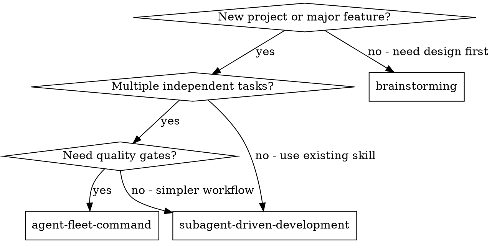

# Agent Fleet Command

## Overview

Orchestrate multi-agent development with three-layer architecture: main agent (orchestrator), sub-agents (implementers), sub-sub-agents (reviewers). Main agent never writes code — it creates documents, dispatches tasks, and checks consistency. Sub-agents implement in dependency-based phases, each creating its own reviewer for two-stage quality gates.

**Core principle:** Main agent orchestrates, sub-agents execute, sub-sub-agents review. No agent crosses role boundaries.

## When to Use



**Use when:**
- Starting a new project with 3+ independent modules
- Need cross-task consistency checks
- Want self-managed review chains per task
- Project has clear dependency layers

**Don't use when:**
- Tasks are tightly coupled (use subagent-driven-development)
- Single task or very small project
- No clear dependency structure

## The Process

### Phase 0: Initialization

1. **Ask user for document output folder** (e.g. `./project-docs/`)
2. Create project folder: `{output-folder}/{project-name}/`
3. Create sub-folders for document organization (see Document Output Structure)
4. Analyze requirements with user
5. Create `project-overview.md` in `00-项目概览/`
6. Create `task-{name}.md` files in each `task-{name}/` folder
7. Analyze dependencies, determine execution phases
8. Create TodoWrite to track all tasks

### Phase N: Execution

For each phase (tasks within a phase are independent and can run in parallel):

1. Dispatch sub-agents for all tasks in the phase (parallel)
2. Each sub-agent:
   - Reads `project-overview.md` (global context)
   - Reads own `task-{name}.md` (specific requirements)
   - Checks skill library, enables relevant skills
   - Implements code (TDD)
   - Self-reviews
   - Creates reviewer sub-sub-agent
   - Waits for review, fixes if needed
   - Submits to main agent
3. Main agent performs incremental consistency check
4. If issues found →退回 to sub-agent
5. If clean → proceed to next phase

### Final Check

After all phases:
1. Completeness: all modules implemented
2. Consistency: interfaces match, style unified
3. Health: no performance/security issues

## Role Constraints

| Role | Can Do | Cannot Do |
|------|--------|-----------|
| Main Agent | Create docs, dispatch, consistency check | Read/write code files |
| Sub-Agent | Implement assigned task, modify scope files only | Modify files outside scope |
| Sub-Sub-Agent | Review code, generate issue report | Modify any code |

## Document Templates

### project-overview.md

```markdown
# 项目名称

## 项目目标
[One sentence: what problem this solves]

## 架构概述
[Overall architecture description]

## 模块划分
### 模块A: [Name]
- 职责: ...
- 依赖: ...
- 对应子任务: task-a.md

## 依赖关系图
[Module dependencies → determines execution phases]

### Phase Determination Rules
1. Modules with no dependencies → Phase 1
2. Modules depending only on Phase 1 outputs → Phase 2
3. Continue until all modules assigned
4. Circular dependency → escalate to user

## 统一规范
- 代码风格: ...
- 命名约定: ...
- 文件组织: ...
- 错误处理模式: ...
```

### task-{name}.md

```markdown
# Task: [Task Name]

## 所属模块
[Which module from main doc]

## 任务目标
[What this task achieves]

## 详细需求
### 功能点1: [Description]
- 验收标准: ...
- 涉及文件: ...

## 约束条件
- 只能修改: [Allowed files/directories]
- 不能修改: [Forbidden files/directories]
- 依赖: [Other task outputs]

## 技术提示
[Implementation suggestions, not mandatory]
```

## Document Output Structure

All generated .md files are organized in a user-specified folder for both agent consumption and human review.

### Setup

At skill start, ask user:
```
请指定文档输出文件夹路径 (例如: ./project-docs/)
```

### Directory Layout

```
{output-folder}/
└── {project-name}/
    ├── 00-项目概览/
    │   ├── project-overview.md          # 主智能体创建的总文档
    │   └── execution-plan.md            # 执行计划（阶段划分）
    ├── 01-task-{name}/
    │   ├── task-{name}.md               # 子智能体的任务文档
    │   └── review-result.md             # 审查子智能体的审查结果
    ├── 02-task-{name}/
    │   ├── task-{name}.md
    │   └── review-result.md
    ├── 03-审查记录/
    │   └── consistency-check-{date}.md  # 主智能体的一致性检查记录
    └── 04-执行日志/
        └── execution-log.md             # 完整执行过程记录
```

### Naming Convention

- `00-` prefix: 项目概览（最高层级）
- `01-`, `02-`, ...: 按任务创建顺序编号
- `03-`: 审查记录
- `04-`: 执行日志

### Who Writes What

| 文件 | 创建者 | 内容 |
|------|--------|------|
| `project-overview.md` | 主智能体 | 架构、模块、规范 |
| `execution-plan.md` | 主智能体 | 阶段划分、依赖图 |
| `task-{name}.md` | 主智能体 | 任务详细需求 |
| `review-result.md` | 审查子智能体 | 审查结果、问题清单 |
| `consistency-check-{date}.md` | 主智能体 | 一致性检查记录 |
| `execution-log.md` | 主智能体 | 完整执行过程 |

### Human Review Benefits

- 打开文件夹即可了解项目全貌
- 按编号顺序阅读 = 按执行顺序回顾
- 每个任务文件夹内：需求文档 + 审查结果一目了然
- 审查记录和执行日志可追溯

## Review System

### Reviewer Sub-Sub-Agent

Created by each sub-agent after implementation. Reads both documents, checks skill library, performs strict code review.

**Review dimensions:**
- Spec compliance: code implements all功能点 from doc
- Constraint adherence: only modified allowed files
- Global consistency: style/naming matches main doc standards
- Code quality: readability, maintainability, error handling
- Test coverage: tests cover main functionality

**Severity levels:**
- Critical: Must fix to pass (blocks submission)
- Important: Should fix (3+ blocks submission)
- Minor: Suggest fix (not blocking)

### Rejection Flow

```
Review fails → Reject to original sub-agent → Fix → Re-review → Repeat until passed → Submit to main agent
```

## Skill Library Integration

Sub-agents check skill library at two stages:
1. Before coding: match by task type (TDD, debugging, etc.)
2. Before review: match by review dimensions

**Priority rule:**
```
项目规则 (project-overview.md + task-{name}.md)  ← 最高优先级
Skill 指令
系统默认行为                              ← 最低优先级
```

## Main Agent Consistency Check

### Incremental (after each sub-task)
1. Report validation (status, modified files)
2. Cross-task comparison (no conflicts)
3. Alignment with main document

### Final (after all tasks)
1. Completeness check
2. Consistency across all modules
3. Health check

## Model Selection

| Role | Model | When |
|------|-------|------|
| Main Agent | Most capable | Architecture, consistency judgment |
| Sub-Agent (simple) | Fast/cheap | 1-2 files, clear spec |
| Sub-Agent (complex) | Standard | Multi-file, integration |
| Reviewer | Most capable | Broad codebase understanding |

## Red Flags

**Never:**
- Main agent reads/writes code files
- Skip reviewer sub-agent
- Skip re-review after fixes
- Let different sub-agent fix another's issues
- Proceed with Critical issues
- Skip incremental or final consistency check
- Use skill instructions that conflict with project rules
